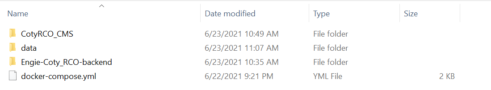
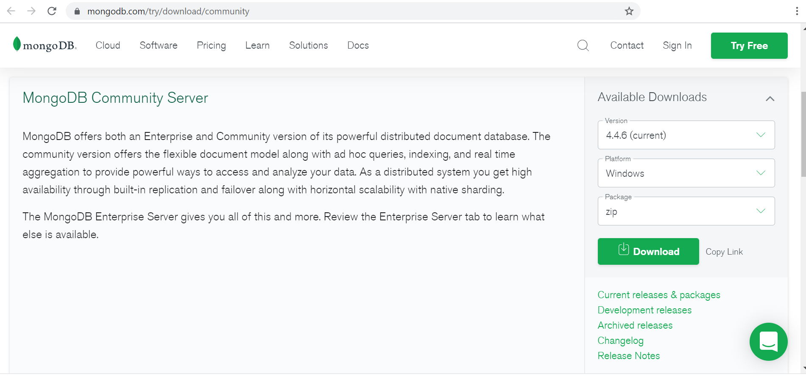
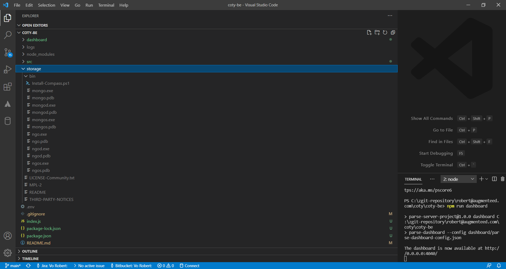

# Setup

## Setup to run docker in dev environment for server and dashboard

Step 1: Get NPM download installer from <https://nodejs.org/en/download/> (prefer use npm6, npm7 cause some issues)

- [MacOS guide](https://blog.teamtreehouse.com/install-node-js-npm-mac)

- [Windows guide](https://phoenixnap.com/kb/install-node-js-npm-on-windows)

Step 2: Setup Docker
required docker-compose to run, follow these steps to install docker desktop on your system

- [MacOS guide](https://docs.docker.com/docker-for-mac/install/)

- [Windows guide](https://docs.docker.com/docker-for-windows/install/)

on Windows, these additional steps are needed

- Update the windows to version 1909
- If you get the hypervisor error update the system bios to latest
- add logined user to docker-users group
- allow docker user to access 'C' and 'D' drive
- choose linux container in docker-desktop installtion step or in docker-desktop context menu  

### - Clone backend code

Step 3: Open the command line at a target folder (call root folder) and clone the backend repo

```git
git clone https://github.com/Augmenteed/Engie-Coty_RCO-backend.git
```

- [Clone guide](https://docs.github.com/en/github/creating-cloning-and-archiving-repositories/cloning-a-repository-from-github/cloning-a-repository)

### - Clone dashboard code

Step 4: Clone the dashboard repo

```git
git clone https://github.com/Augmenteed/CotyRCO_CMS.git
```

Step 5: Download the docker-compose.yml [here](https://drive.google.com/file/d/1hFwVoxRlau7qCLdN6_3IpNwKKnrUqhzC/view?usp=sharing) and put it at root folder



Step 6: Run docker compose

- MacOS

```npm
docker-compose up
```

- Window

```npm
docker compose up
```

Step 7: Access dashboard with account:

Username: superadmin

Password: <SUPER_ADMIN_PASSWORD> in docker-compose.yml file

# Setup to deploy backend in customer server

Step 1: Get NPM
download installer from <https://nodejs.org/en/download/>

- [Setup guide](https://phoenixnap.com/kb/install-node-js-npm-on-windows)

Step 2: Clone this repo

```git
git clone https://github.com/Augmenteed/Engie-Coty_RCO-backend.git
```

- [Clone guide](https://docs.github.com/en/github/creating-cloning-and-archiving-repositories/cloning-a-repository-from-github/cloning-a-repository)

Step 3: Download mongoDB zip folder from <https://www.mongodb.com/try/download/community>



Step 4: Extract the zip folder and rename it to "storage"



Step 5: Open a terminal at the root of the source code and run command to install the dependencies

```npm
npm install
```

Step 6: Start Server

```npm
npm start
```
